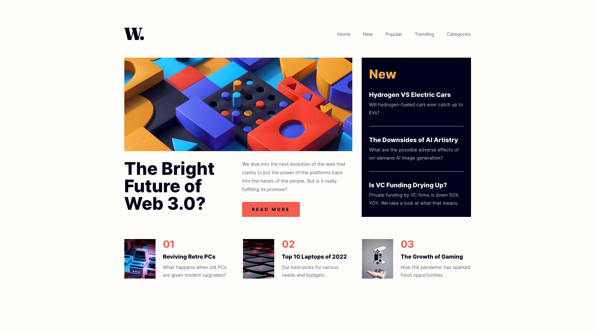
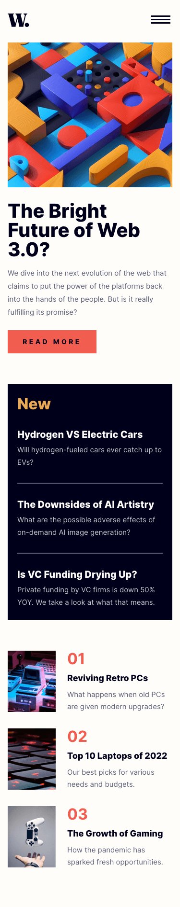

# Frontend Mentor - News homepage solution

This is a solution to the [News homepage challenge on Frontend Mentor](https://www.frontendmentor.io/challenges/news-homepage-H6SWTa1MFl). Frontend Mentor challenges help you improve your coding skills by building realistic projects.

## Table of contents

- [Overview](#overview)
  - [The challenge](#the-challenge)
  - [Screenshot](#screenshot)
  - [Links](#links)
- [My process](#my-process)
  - [Built with](#built-with)
  - [What I learned](#what-i-learned)
  - [Continued development](#continued-development)
  - [Useful resources](#useful-resources)
- [Author](#author)

## Overview

### The challenge

Users should be able to:

- View the optimal layout for the interface depending on their device's screen size
- See hover and focus states for all interactive elements on the page

### Screenshot




### Links

- Solution URL: [https://github.com/srijanss/news-homepage](https://github.com/srijanss/news-homepage)
- Live Site URL: [https://srijanss.github.io/news-homepage/](https://srijanss.github.io/news-homepage/)

## My process

### Built with

- Semantic HTML5 markup
- CSS custom properties
- Flexbox
- CSS Grid
- Mobile-first workflow
- [Vite](https://vitejs.dev/) - Lightweight frontend tooling
- [PostCSS](https://postcss.org/) - Tool to transform CSS using plugins

### What I learned

- I learned about different aria attributes and its use cases

```html
<button id="hamburger-icon" aria-expanded="false" aria-controls="menu">
  
</button>
<nav id="menu" aria-label="Primary">
  <div class="overlay"></div>
  <div id="menu-content">
    <button id="close-icon" aria-expanded="false" aria-controls="menu">
      
    </button>
  </div>
</nav>
```

- I learned about the transition CSS property that I used for opening and closing the nav menu

```css
nav {
  transform: translateX(100%);
  transition: transform 0.3s ease-in-out;
}
```

- I also learned about how to set and remove focus on the element programatically using tabindex

```js
addFocusToMenuItems() {
    this.hamburgerIcon.setAttribute("aria-expanded", "true");
    this.hamburgerIcon.setAttribute("aria-hidden", "true");
    this.closeIcon.setAttribute("aria-expanded", "true");
    this.closeIcon.setAttribute("aria-hidden", "false");
    this.closeIcon.setAttribute("tabindex", "0");
    Array.from(this.linkList).forEach((link) => {
      link.setAttribute("tabindex", "0");
      link.setAttribute("aria-hidden", "false");
    });
  }

  removeFocusFromMenuItems() {
    this.hamburgerIcon.setAttribute("aria-expanded", "false");
    this.hamburgerIcon.setAttribute("aria-hidden", "false");
    this.closeIcon.setAttribute("aria-expanded", "false");
    this.closeIcon.setAttribute("aria-hidden", "true");
    this.closeIcon.setAttribute("tabindex", "-1");
    Array.from(this.linkList).forEach((link) => {
      link.setAttribute("tabindex", "-1");
      link.setAttribute("aria-hidden", "true");
    });
  }
```

### Useful resources

- [Accessibility ARIA](https://developer.mozilla.org/en-US/docs/Web/Accessibility/ARIA)

## Author

- Website - [Srijan Manandhar](https://github.com/srijanss)
- Frontend Mentor - [@srijanss](https://www.frontendmentor.io/profile/srijanss)
